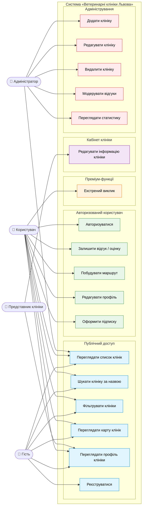

# UML — Діаграма прецедентів (Use Case Diagram)

## Актори

- **Гість** — незареєстрований користувач
- **Користувач** — зареєстрований власник тварини
- **Представник клініки** — уповноважений представник
- **Адміністратор** — системний менеджер

## Діаграма (Mermaid)

## Опис прецедентів

| ID | Назва | Актор | Опис |
|---|---|---|---|
| UC1 | Переглядати список клінік | Усі | Відображення переліку клінік з назвою, рейтингом, адресою |
| UC2 | Шукати клініку за назвою | Усі | Текстовий пошук з індексуванням |
| UC3 | Фільтрувати клініки | Усі | Фільтри: 24/7, район, послуги, рейтинг |
| UC4 | Переглядати карту клінік | Усі | Інтерактивна карта з маркерами клінік |
| UC5 | Переглядати профіль клініки | Усі | Деталі: контакти, графік, послуги, відгуки |
| UC6 | Реєструватися | Гість | Створення облікового запису |
| UC7 | Авторизуватися | Користувач | Вхід за email + паролем |
| UC8 | Залишити відгук / оцінку | Користувач | Додавання відгуку (текст + 1–5 зірок) |
| UC9 | Побудувати маршрут | Користувач | Прокладання маршруту до клініки на карті |
| UC10 | Редагувати профіль | Користувач | Зміна імені, аватару, даних |
| UC11 | Оформити підписку | Користувач | Активація преміум-доступу |
| UC12 | Екстрений виклик | Користувач (Преміум) | Відправка координат і заявки на допомогу |
| UC13 | Редагувати інформацію клініки | Представник | Оновлення даних своєї клініки |
| UC14 | Додати клініку | Адміністратор | Внесення нової клініки в базу |
| UC15 | Редагувати клініку | Адмін / Представник | Зміна даних клініки |
| UC16 | Видалити клініку | Адміністратор | Видалення клініки з системи |
| UC17 | Модерувати відгуки | Адміністратор | Видалення неприйнятних відгуків |
| UC18 | Переглядати статистику | Адміністратор | Графіки по клініках, відгуках |
