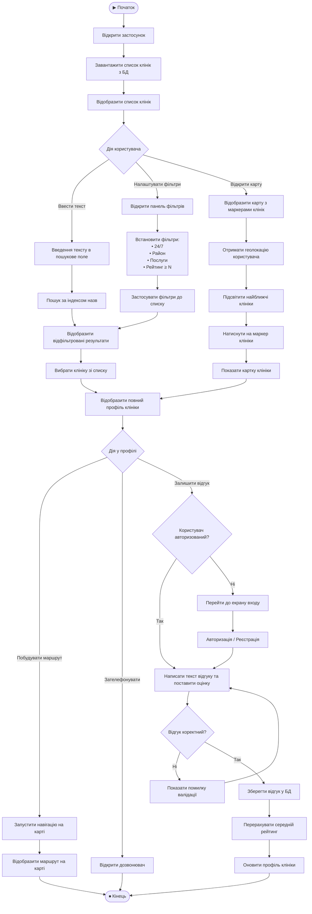
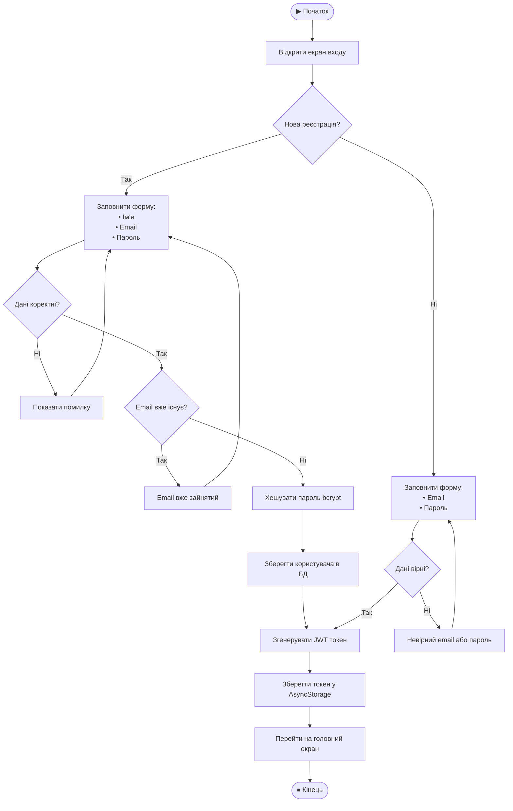
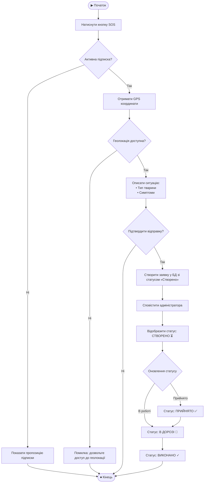

# UML — Діаграми активності (Activity Diagrams)

## 1. Пошук та перегляд клініки

```mermaid
flowchart TD
    Start([▶ Початок]) --> OpenApp[Відкрити застосунок]
    OpenApp --> LoadClinics[Завантажити список клінік з БД]
    LoadClinics --> ShowList[Відобразити список клінік]

    ShowList --> UserChoice{Дія користувача}

    UserChoice -->|Ввести текст| TypeSearch[Введення тексту в пошукове поле]
    TypeSearch --> SearchIndex[Пошук за індексом назв]
    SearchIndex --> ShowResults[Відобразити відфільтровані результати]

    UserChoice -->|Налаштувати фільтри| OpenFilters[Відкрити панель фільтрів]
    OpenFilters --> SetFilters["Встановити фільтри:\n• 24/7\n• Район\n• Послуги\n• Рейтинг ≥ N"]
    SetFilters --> ApplyFilters[Застосувати фільтри до списку]
    ApplyFilters --> ShowResults

    UserChoice -->|Відкрити карту| ShowMap[Відобразити карту з маркерами клінік]
    ShowMap --> GetLocation[Отримати геолокацію користувача]
    GetLocation --> ShowNearby[Підсвітити найближчі клініки]
    ShowNearby --> TapMarker[Натиснути на маркер клініки]
    TapMarker --> ShowClinicCard[Показати картку клініки]

    ShowResults --> SelectClinic[Вибрати клініку зі списку]
    SelectClinic --> ShowProfile

    ShowClinicCard --> ShowProfile[Відобразити повний профіль клініки]

    ShowProfile --> ProfileAction{Дія у профілі}

    ProfileAction -->|Побудувати маршрут| BuildRoute[Запустити навігацію на карті]
    ProfileAction -->|Зателефонувати| Call[Відкрити дозвонювач]
    ProfileAction -->|Залишити відгук| CheckAuth{Користувач авторизований?}

    CheckAuth -->|Так| WriteReview[Написати текст відгуку та поставити оцінку]
    CheckAuth -->|Ні| GoLogin[Перейти до екрану входу]
    GoLogin --> Login[Авторизація / Реєстрація]
    Login --> WriteReview

    WriteReview --> ValidateReview{Відгук коректний?}
    ValidateReview -->|Ні| ShowError[Показати помилку валідації]
    ShowError --> WriteReview
    ValidateReview -->|Так| SaveReview[Зберегти відгук у БД]
    SaveReview --> RecalcRating[Перерахувати середній рейтинг]
    RecalcRating --> ShowUpdatedProfile[Оновити профіль клініки]

    BuildRoute --> ShowRouteOnMap[Відобразити маршрут на карті]
    Call --> End([⏹ Кінець])
    ShowUpdatedProfile --> End
    ShowRouteOnMap --> End
```

---

## 2. Реєстрація та авторизація

```mermaid
flowchart TD
    Start([▶ Початок]) --> OpenAuth[Відкрити екран входу]
    OpenAuth --> AuthChoice{Нова реєстрація?}

    AuthChoice -->|Так| FillRegForm["Заповнити форму:\n• Ім'я\n• Email\n• Пароль"]
    FillRegForm --> ValidateReg{Дані коректні?}
    ValidateReg -->|Ні| ShowRegError[Показати помилку]
    ShowRegError --> FillRegForm
    ValidateReg -->|Так| CheckEmailExists{Email вже існує?}
    CheckEmailExists -->|Так| ShowEmailError[Email вже зайнятий]
    ShowEmailError --> FillRegForm
    CheckEmailExists -->|Ні| HashPassword[Хешувати пароль bcrypt]
    HashPassword --> SaveUser[Зберегти користувача в БД]
    SaveUser --> GenerateJWT[Згенерувати JWT токен]
    GenerateJWT --> StoreToken[Зберегти токен у AsyncStorage]
    StoreToken --> GoHome[Перейти на головний екран]

    AuthChoice -->|Ні| FillLoginForm["Заповнити форму:\n• Email\n• Пароль"]
    FillLoginForm --> CheckCredentials{Дані вірні?}
    CheckCredentials -->|Ні| ShowLoginError[Невірний email або пароль]
    ShowLoginError --> FillLoginForm
    CheckCredentials -->|Так| GenerateJWT

    GoHome --> End([⏹ Кінець])
```

---

## 3. Екстрений виклик (Преміум)

```mermaid
flowchart TD
    Start([▶ Початок]) --> TapSOS[Натиснути кнопку SOS]
    TapSOS --> CheckPremium{Активна підписка?}

    CheckPremium -->|Ні| ShowUpsell[Показати пропозицію підписки]
    ShowUpsell --> End([⏹ Кінець])

    CheckPremium -->|Так| GetGeo[Отримати GPS координати]
    GetGeo --> GeoSuccess{Геолокація доступна?}
    GeoSuccess -->|Ні| ShowGeoError[Помилка: дозвольте доступ до геолокації]
    ShowGeoError --> End

    GeoSuccess -->|Так| FillEmergencyForm["Описати ситуацію:\n• Тип тварини\n• Симптоми"]
    FillEmergencyForm --> ConfirmSend{Підтвердити відправку?}
    ConfirmSend -->|Ні| End
    ConfirmSend -->|Так| CreateRequest[Створити заявку у БД зі статусом «Створено»]
    CreateRequest --> NotifyAdmin[Сповістити адміністратора]
    NotifyAdmin --> ShowStatus["Відобразити статус: СТВОРЕНО ⏳"]

    ShowStatus --> StatusUpdate{Оновлення статусу}
    StatusUpdate -->|Прийнято| ShowAccepted["Статус: ПРИЙНЯТО ✅"]
    StatusUpdate -->|В роботі| ShowInProgress["Статус: В ДОРОЗІ 🚗"]
    ShowInProgress --> ShowCompleted["Статус: ВИКОНАНО ✓"]
    ShowAccepted --> ShowInProgress
    ShowCompleted --> End
```
