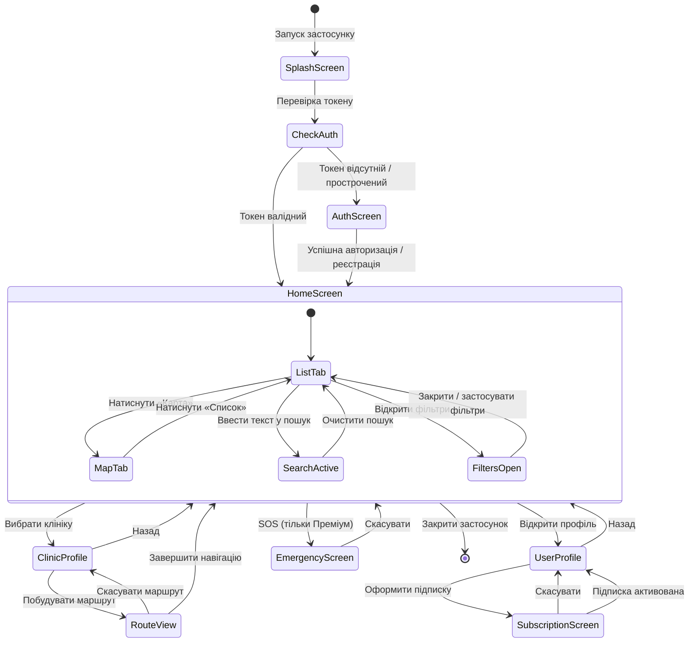
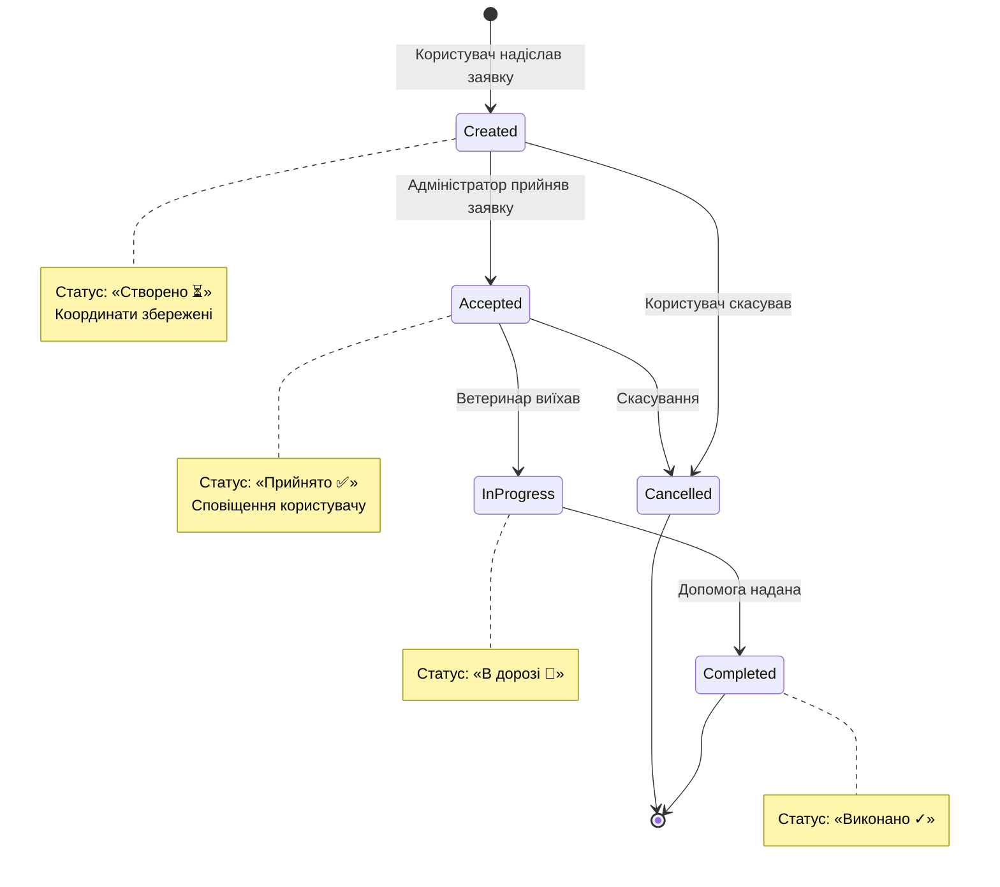
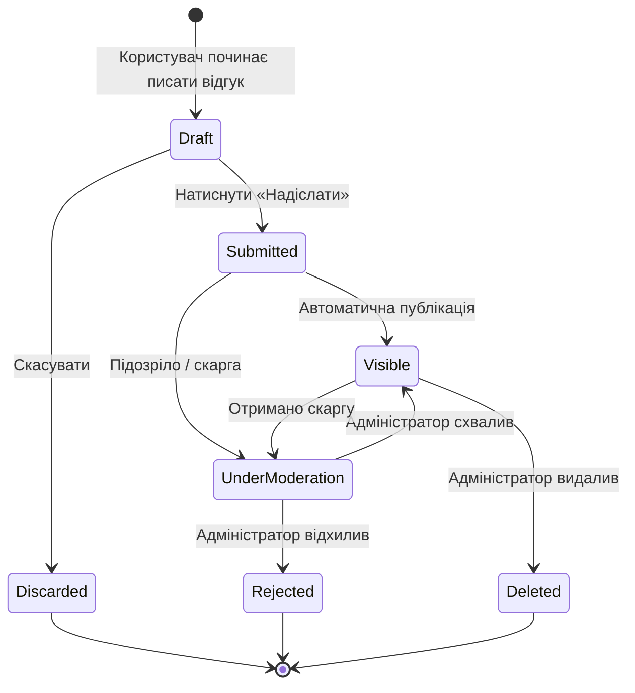

# UML — Діаграми станів (State Diagrams)

## 1. Стани застосунку (навігація)

```mermaid
stateDiagram-v2
    [*] --> SplashScreen : Запуск застосунку

    SplashScreen --> CheckAuth : Перевірка токену
    CheckAuth --> HomeScreen : Токен валідний
    CheckAuth --> AuthScreen : Токен відсутній / прострочений

    AuthScreen --> HomeScreen : Успішна авторизація / реєстрація

    state HomeScreen {
        [*] --> ListTab
        ListTab --> MapTab : Натиснути «Карта»
        MapTab --> ListTab : Натиснути «Список»
        ListTab --> SearchActive : Ввести текст у пошук
        SearchActive --> ListTab : Очистити пошук
        ListTab --> FiltersOpen : Відкрити фільтри
        FiltersOpen --> ListTab : Закрити / застосувати фільтри
    }

    HomeScreen --> ClinicProfile : Вибрати клініку
    ClinicProfile --> HomeScreen : Назад
    ClinicProfile --> RouteView : Побудувати маршрут
    RouteView --> ClinicProfile : Скасувати маршрут
    RouteView --> HomeScreen : Завершити навігацію

    HomeScreen --> UserProfile : Відкрити профіль
    UserProfile --> HomeScreen : Назад
    UserProfile --> SubscriptionScreen : Оформити підписку
    SubscriptionScreen --> UserProfile : Скасувати
    SubscriptionScreen --> UserProfile : Підписка активована

    HomeScreen --> EmergencyScreen : SOS (тільки Преміум)
    EmergencyScreen --> HomeScreen : Скасувати

    HomeScreen --> [*] : Закрити застосунок
```

---

## 2. Стани заявки на екстрений виклик

```mermaid
stateDiagram-v2
    [*] --> Created : Користувач надіслав заявку

    Created --> Accepted : Адміністратор прийняв заявку
    Created --> Cancelled : Користувач скасував

    Accepted --> InProgress : Ветеринар виїхав
    Accepted --> Cancelled : Скасування

    InProgress --> Completed : Допомога надана

    Completed --> [*]
    Cancelled --> [*]

    note right of Created
        Статус: «Створено ⏳»
        Координати збережені
    end note

    note right of Accepted
        Статус: «Прийнято ✅»
        Сповіщення користувачу
    end note

    note right of InProgress
        Статус: «В дорозі 🚗»
    end note

    note right of Completed
        Статус: «Виконано ✓»
    end note
```

---

## 3. Стани відгуку

```mermaid
stateDiagram-v2
    [*] --> Draft : Користувач починає писати відгук

    Draft --> Submitted : Натиснути «Надіслати»
    Draft --> Discarded : Скасувати

    Submitted --> Visible : Автоматична публікація
    Submitted --> UnderModeration : Підозріло / скарга

    UnderModeration --> Visible : Адміністратор схвалив
    UnderModeration --> Rejected : Адміністратор відхилив

    Visible --> UnderModeration : Отримано скаргу
    Visible --> Deleted : Адміністратор видалив

    Discarded --> [*]
    Rejected --> [*]
    Deleted --> [*]
```
