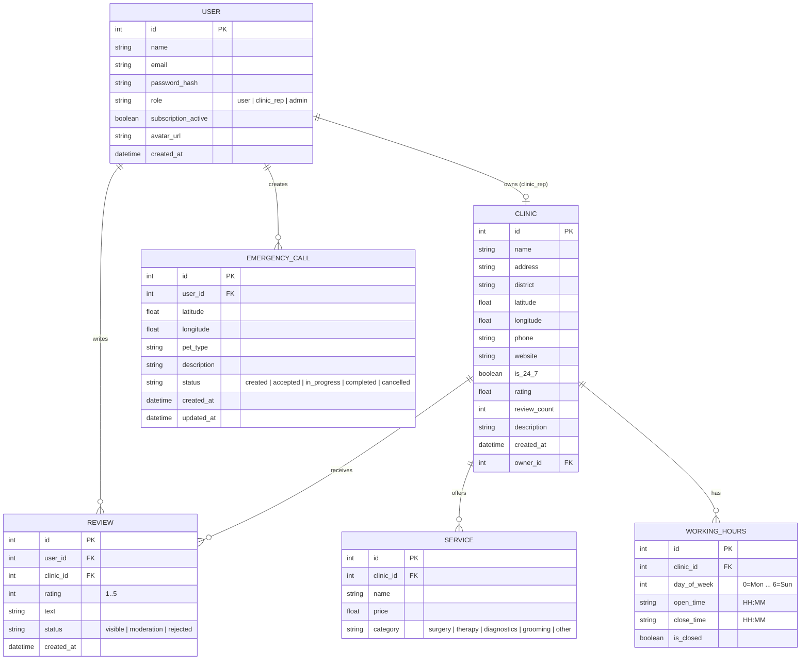

# Структура даних

## ER-діаграма



---

## Опис таблиць

### `users`
| Поле | Тип | Опис |
|---|---|---|
| id | INTEGER PK | Первинний ключ |
| name | TEXT | Повне ім'я |
| email | TEXT UNIQUE | Email (логін) |
| password_hash | TEXT | Bcrypt-хеш паролю |
| role | TEXT | Роль: `user`, `clinic_rep`, `admin` |
| subscription_active | BOOLEAN | Чи активна преміум-підписка |
| avatar_url | TEXT | URL аватару (nullable) |
| created_at | DATETIME | Дата реєстрації |

### `clinics`
| Поле | Тип | Опис |
|---|---|---|
| id | INTEGER PK | Первинний ключ |
| name | TEXT | Назва клініки |
| address | TEXT | Повна адреса |
| district | TEXT | Район Львова |
| latitude | REAL | Широта (GPS) |
| longitude | REAL | Довгота (GPS) |
| phone | TEXT | Телефон |
| website | TEXT | Сайт (nullable) |
| is_24_7 | BOOLEAN | Цілодобово? |
| rating | REAL | Середній рейтинг (0.0–5.0) |
| review_count | INTEGER | Кількість відгуків |
| description | TEXT | Опис (nullable) |
| owner_id | INTEGER FK | ID представника клініки (nullable) |
| created_at | DATETIME | Дата додавання |

### `services`
| Поле | Тип | Опис |
|---|---|---|
| id | INTEGER PK | Первинний ключ |
| clinic_id | INTEGER FK | ID клініки |
| name | TEXT | Назва послуги |
| price | REAL | Орієнтовна вартість (UAH) |
| category | TEXT | Категорія: `surgery`, `therapy`, `diagnostics`, `grooming`, `other` |

### `working_hours`
| Поле | Тип | Опис |
|---|---|---|
| id | INTEGER PK | Первинний ключ |
| clinic_id | INTEGER FK | ID клініки |
| day_of_week | INTEGER | День тижня (0=Пн, 6=Нд) |
| open_time | TEXT | Час відкриття `HH:MM` |
| close_time | TEXT | Час закриття `HH:MM` |
| is_closed | BOOLEAN | Вихідний день |

### `reviews`
| Поле | Тип | Опис |
|---|---|---|
| id | INTEGER PK | Первинний ключ |
| user_id | INTEGER FK | Автор відгуку |
| clinic_id | INTEGER FK | Клініка |
| rating | INTEGER | Оцінка 1–5 |
| text | TEXT | Текст відгуку |
| status | TEXT | `visible`, `moderation`, `rejected` |
| created_at | DATETIME | Дата відгуку |

### `emergency_calls`
| Поле | Тип | Опис |
|---|---|---|
| id | INTEGER PK | Первинний ключ |
| user_id | INTEGER FK | Хто викликав |
| latitude | REAL | Широта користувача |
| longitude | REAL | Довгота користувача |
| pet_type | TEXT | Тип тварини |
| description | TEXT | Опис ситуації |
| status | TEXT | `created`, `accepted`, `in_progress`, `completed`, `cancelled` |
| created_at | DATETIME | Час створення |
| updated_at | DATETIME | Час останнього оновлення |

---

## Структура JSON-файлу (seed-дані клінік)

```json
{
  "clinics": [
    {
      "id": 1,
      "name": "Ветеринарна клініка «Айболить»",
      "address": "вул. Сахарова, 42, Львів",
      "district": "Личаківський",
      "latitude": 49.8397,
      "longitude": 24.0297,
      "phone": "+380971234567",
      "website": "https://aibolit.lviv.ua",
      "is_24_7": true,
      "rating": 4.7,
      "review_count": 128,
      "services": [
        { "name": "Огляд", "price": 200, "category": "therapy" },
        { "name": "УЗД", "price": 450, "category": "diagnostics" },
        { "name": "Хірургія", "price": 1500, "category": "surgery" }
      ],
      "working_hours": [
        { "day_of_week": 0, "open_time": "00:00", "close_time": "23:59", "is_closed": false }
      ]
    }
  ]
}
```

---

## Локальне сховище (AsyncStorage)

| Ключ | Значення | Опис |
|---|---|---|
| `auth_token` | JWT string | Токен авторизованого користувача |
| `user_data` | JSON | Кешовані дані профілю |
| `favorites` | JSON array | ID збережених клінік |
| `last_search` | string | Останній пошуковий запит |
| `filters` | JSON | Останні застосовані фільтри |
